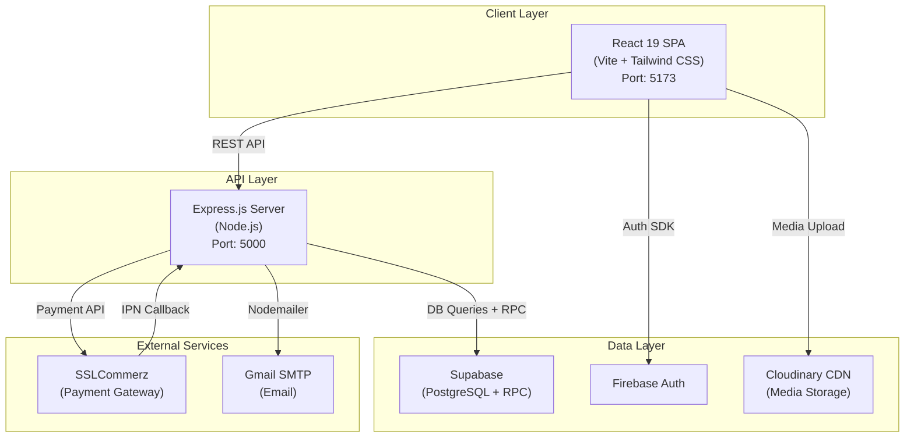
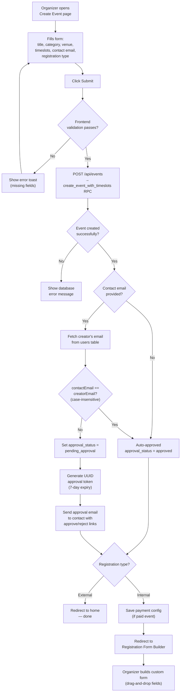
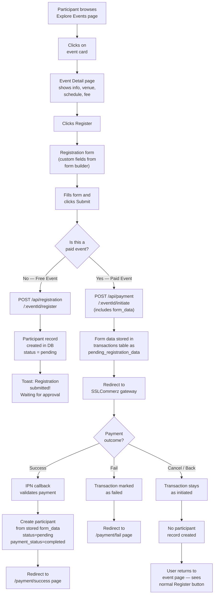
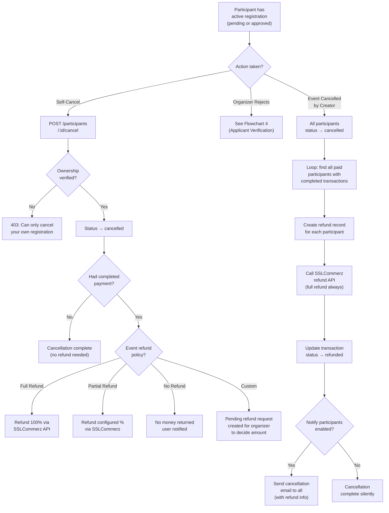
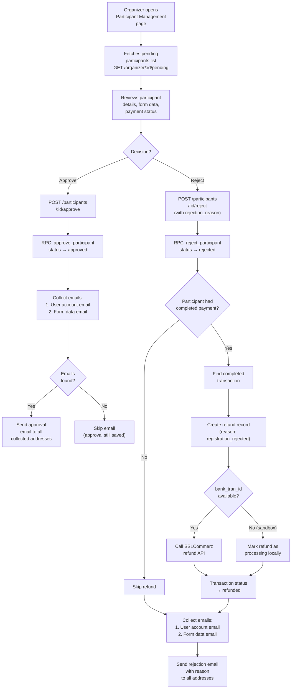
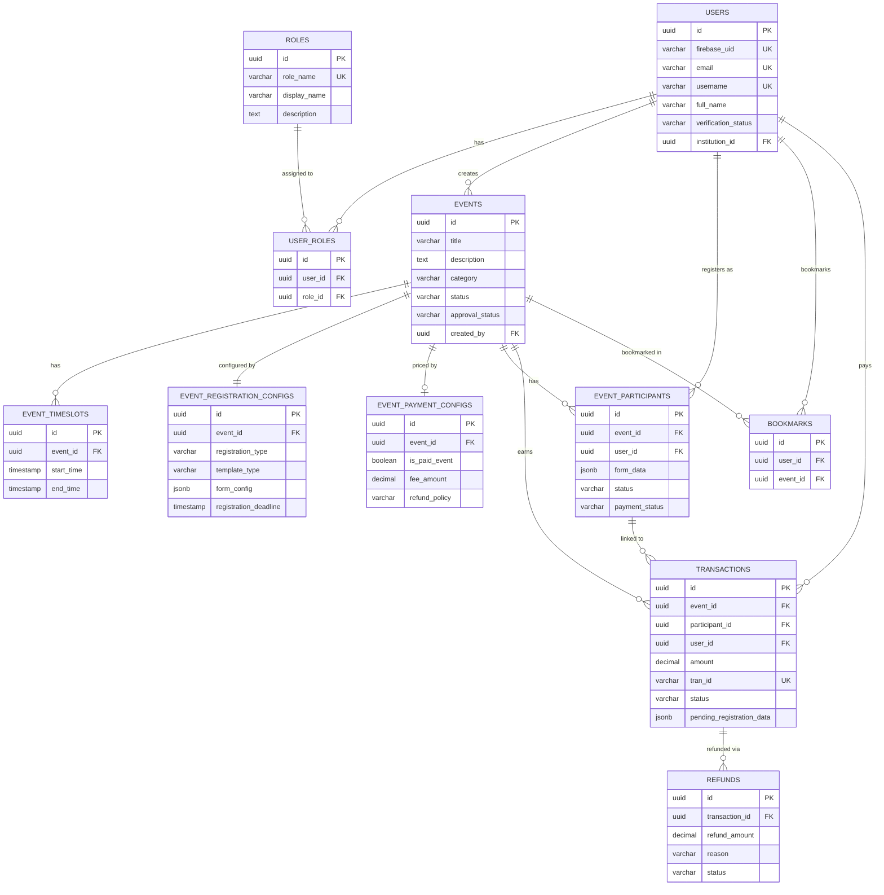

# Event Corner — Project Report

---

## Table of Contents

- [a. Introduction](#a-introduction)
  - [Background](#background)
  - [Objectives](#objectives)
  - [Overview](#overview)
- [b. Requirements](#b-requirements)
  - [Functional Requirements](#functional-requirements)
  - [Non-Functional Requirements](#non-functional-requirements)
- [c. High-Level and Detailed-Level Design](#c-high-level-and-detailed-level-design)
  - [High-Level Architecture](#high-level-architecture)
  - [Detailed-Level Design: Flowcharts](#detailed-level-design-flowcharts)
    - [Flowchart 1 — Event Creation by Organizer](#flowchart-1--event-creation-by-organizer-with-email-verification)
    - [Flowchart 2 — Participant Registration & Payment Flow](#flowchart-2--participant-registration--payment-flow)
    - [Flowchart 3 — Participant Post-Registration Edge Cases](#flowchart-3--participant-post-registration-edge-cases)
    - [Flowchart 4 — Organizer Applicant Verification](#flowchart-4--organizer-applicant-verification)
  - [Entity Relationship Diagram](#entity-relationship-diagram)
- [d. Source Code](#d-source-code)
  - [Frontend (React SPA)](#frontend-react-spa)
  - [Backend (Node.js / Express)](#backend-nodejs--express)
  - [External Services](#external-services)
  - [Hardware Requirements](#hardware-requirements)
- [e. Project Evaluation Report](#e-project-evaluation-report)
  - [i. Test Cases](#i-test-cases)
  - [ii. Test Execution Results](#ii-test-execution-results)
  - [iii. Analysis](#iii-analysis)
- [f. Software Sustainability & Professional Practices](#f-software-sustainability--professional-practices)
  - [Scalability](#scalability)
  - [Reusability](#reusability)
  - [Energy Efficiency](#energy-efficiency)
  - [Long-Term Maintainability](#long-term-maintainability)
  - [Ethical Coding Standards](#ethical-coding-standards)
- [g. Conclusion](#g-conclusion)

---

## a. Introduction

### Background

Managing events within educational institutions — from seminars and workshops to hackathons and cultural festivals — remains a largely fragmented process. Announcements are scattered across social media groups, registrations are handled through Google Forms with no payment integration, and organizers lack any centralized dashboard to track participants, revenue, or event status. This disconnected approach leads to lost registrations, manual payment reconciliation, and poor communication between organizers and participants.

### Objectives

Event Corner is a comprehensive, role-based event management web application designed to solve these problems. The core objectives are:

1. **Centralized Event Lifecycle Management** — Enable institutions and organizers to create, publish, and manage events through a single platform with admin oversight.
2. **Secure Online Payments** — Integrate SSLCommerz payment gateway (bKash, Nagad, Visa, Mastercard) with configurable refund policies and deferred registration (no DB entry until payment succeeds).
3. **Automated Communication** — Send email notifications for event approvals, registration status changes, and event cancellations via SMTP.
4. **Multi-Role Access Control** — Support five roles (Super Admin, Admin, Institution, Organizer, Participant), each with a dedicated dashboard and appropriate permissions.

### Overview

The application is architected as two loosely coupled services:

- A **React 19 SPA** (Vite + Tailwind CSS) serving the user interface
- An **Express.js REST API** handling business logic, database operations, and payment callbacks

Data is stored in **Supabase** (managed PostgreSQL), authentication is handled by **Firebase**, media assets are hosted on **Cloudinary**, and payments are processed by **SSLCommerz**.

---

## b. Requirements

### Functional Requirements

| ID | Module | Requirement | Priority |
|----|--------|-------------|----------|
| FR-01 | Authentication | Users register with email/password via Firebase Auth with role selection (participant, organizer, institution). Login returns user data, roles, and verification status. | High |
| FR-02 | Institution Verification | Institutions upload EIIN number and verification documents during registration. Admins review and approve or reject with reason. | High |
| FR-03 | Event Creation | Organizers/institutions create events with title, description, category, tags, venue (map-based selection via Leaflet), date/time slots (calendar picker), banner image, and contact information. | High |
| FR-04 | Event Email Verification | If the event's contact email differs from the creator's account email, an approval token is generated and an approval email is sent to the contact. The event remains in "pending approval" until the contact approves via the email link. | High |
| FR-05 | Event Approval by Admin | Admins can review pending events and approve or reject them with reasons. Creators receive email notifications of the decision. | High |
| FR-06 | Registration Form Builder | Organizers build custom registration forms with a drag-and-drop form builder supporting text, email, phone, dropdown, checkbox, and file upload fields. Both individual and team-based templates are supported. | High |
| FR-07 | Payment Configuration | Organizers can configure paid events with fee amount, currency, and refund policy (full refund, partial refund, no refund, or custom). | High |
| FR-08 | Event Discovery | Participants browse/search published events with filtering by category, date, and status on an explore page. Events display in cards with detailed view pages. | High |
| FR-09 | Free Event Registration | For free events, participants submit the registration form and a participant record is created immediately with status "pending". | High |
| FR-10 | Paid Event Registration | For paid events, form data is stored in the transaction record and the user is redirected to SSLCommerz. The participant record is only created after successful payment (via IPN callback). If the user presses back or payment fails, no registration is saved. | High |
| FR-11 | Participant Self-Cancellation | Participants can cancel their own registration. Refunds are processed according to the event's configured refund policy (full, partial, none, or custom — where custom creates a pending refund request for the organizer). | Medium |
| FR-12 | Organizer Participant Management | Organizers view pending/approved/rejected participants. They can approve or reject applications. Rejection triggers automatic refund if the participant had paid. Email notifications are sent for both decisions. | High |
| FR-13 | Event Cancellation | Event creators can cancel their event. This cancels all participant registrations, processes full refunds for all paid participants (regardless of refund policy), and sends cancellation emails. | High |
| FR-14 | Bookmarks & Calendar | Participants bookmark events and view them in a calendar with day/week views (FullCalendar). | Low |
| FR-15 | Transaction History | Participants view their payment history. Organizers and institutions have payment dashboards showing revenue per event with refund tracking. | Medium |
| FR-16 | Role Management | Super admins can assign or revoke any role for any user. | High |
| FR-17 | User Profiles | All users have editable profiles with profile picture and banner (Cloudinary-hosted). Institution profiles display verification status and badge. | Medium |

### Non-Functional Requirements

| ID | Category | Requirement |
|----|----------|-------------|
| NFR-01 | **Security** | Helmet.js for HTTP security headers; Firebase Auth for identity management; rate limiting (100 req/15min general, 10 req/15min for auth); CORS configuration. |
| NFR-02 | **Performance** | Pagination on all list endpoints; database indexing on `firebase_uid`, `email`, `event_id`, `user_id`, `status`; Vite code-splitting and lazy loading. |
| NFR-03 | **Scalability** | Stateless Express API supports horizontal scaling; Supabase provides managed PostgreSQL with connection pooling. |
| NFR-04 | **Usability** | Responsive design with Tailwind CSS + DaisyUI; toast notifications via react-hot-toast; loading states and error messages on all async operations. |
| NFR-05 | **Reliability** | Dual payment confirmation (IPN callback + browser redirect) ensures no payment is missed; scheduled cron jobs via node-cron for periodic tasks. |
| NFR-06 | **Maintainability** | Modular route files per domain; service layer separation; SQL migration files (8 files) for schema versioning; `.env`-based configuration with `.env.example` templates. |

---

## c. High-Level and Detailed-Level Design

### High-Level Architecture

### Detailed-Level Design: Flowcharts

#### Flowchart 1 — Event Creation by Organizer (with Email Verification)

#### Flowchart 2 — Participant Registration & Payment Flow

#### Flowchart 3 — Participant Post-Registration Edge Cases

#### Flowchart 4 — Organizer Applicant Verification

### Entity Relationship Diagram

---

## d. Source Code

### Summary of Software/Hardware Packages and Libraries Used

#### Frontend (React SPA)

| Package | Version | Purpose |
|---------|---------|---------|
| React | 19.2.0 | Component-based UI library |
| React Router DOM | 7.10.1 | Client-side routing with protected routes and nested layouts |
| Vite | 7.2.4 | Fast build tool and HMR dev server |
| Tailwind CSS | 3.4.18 | Utility-first CSS framework for responsive design |
| DaisyUI | 3.9.4 | Tailwind component library for pre-built UI elements |
| Firebase | 12.6.0 | Authentication (email/password sign-up and login) |
| Axios | 1.13.2 | HTTP client for REST API calls |
| Leaflet + React-Leaflet | 1.9.4 / 5.0.0 | Interactive maps for event venue selection and display |
| Leaflet GeoSearch | 4.2.2 | Location search within map components |
| FullCalendar | 6.1.19 | Calendar widget with day/week grid views for event schedules |
| Cloudinary React | 1.14.3 | Image upload and CDN delivery for banners and profile pictures |
| React MD Editor | 4.0.11 | Markdown editor for rich event descriptions |
| React Markdown | 10.1.0 | Markdown rendering in event detail pages |
| React Icons | 5.5.0 | Feather icon set used across the UI |
| React Hot Toast | 2.6.0 | Non-blocking toast notifications |
| Lottie React | 2.4.1 | Animated SVG illustrations for loading states |
| Moment Timezone | 0.6.0 | Timezone-aware date/time formatting |

#### Backend (Node.js / Express)

| Package | Version | Purpose |
|---------|---------|---------|
| Express | 4.18.2 | HTTP server framework with middleware pipeline |
| Supabase JS | 2.38.4 | Client for PostgreSQL queries and RPC stored procedure calls |
| Helmet | 7.1.0 | Sets secure HTTP headers (X-Frame-Options, CSP, etc.) |
| CORS | 2.8.5 | Cross-Origin Resource Sharing for frontend-backend communication |
| Express Rate Limit | 7.1.5 | Throttles API requests to prevent abuse |
| dotenv | 16.3.1 | Loads environment variables from `.env` files |
| JSON Web Token | 9.0.0 | JWT creation and verification for auth tokens |
| Multer | 2.0.2 | Multipart file upload handling (registration documents) |
| Nodemailer | 7.0.12 | SMTP email sending via Gmail for notifications |
| SSLCommerz LTS | 1.2.0 | SSLCommerz payment gateway SDK (initiate, validate, refund) |
| Node Cron | 4.2.1 | Scheduled task execution (periodic cleanup jobs) |
| Nodemon | 3.0.1 | Auto-restart dev server on file changes |

#### External Services

| Service | Role in System |
|---------|---------------|
| **Supabase** | Managed PostgreSQL database with Row Level Security, stored procedures, and auto-generated REST API |
| **Firebase** | User authentication (email/password) — handles password hashing and session management |
| **Cloudinary** | CDN-delivered image hosting for event banners, profile pictures, and verification documents |
| **SSLCommerz** | Bangladesh's leading payment gateway — supports bKash, Nagad, Visa, Mastercard, and bank transfers |
| **Gmail SMTP** | Transactional email delivery for approvals, rejections, cancellations, and notifications |

#### Hardware Requirements

| Component | Minimum Specification |
|-----------|----------------------|
| Development Machine | 8 GB RAM, modern multi-core CPU, Node.js 18+ |
| Production Hosting | Any cloud VM or PaaS (Vercel for frontend, Railway/Render for backend) |
| Database | Supabase free tier (500 MB) or pro tier for production |

---

## e. Project Evaluation Report

### i. Test Cases

| ID | Module | Test Case Description | Preconditions | Steps | Expected Result |
|----|--------|-----------------------|---------------|-------|-----------------|
| TC-01 | Auth | Register as participant | None | Enter email, username, password, select "Participant", submit | Account created, redirected to participant dashboard |
| TC-02 | Auth | Register as institution | None | Enter details + EIIN + upload verification docs, submit | Account created with `verification_status = pending` |
| TC-03 | Auth | Login with valid credentials | Account exists | Enter email + password, click login | Dashboard loaded with correct role |
| TC-04 | Auth | Login with wrong password | Account exists | Enter email + wrong password | Error toast: "Invalid credentials" |
| TC-05 | Event Creation | Create event — emails match | Logged in as organizer | Fill form with contactEmail = own email, submit | Event created with `approval_status = approved` |
| TC-06 | Event Creation | Create event — emails differ | Logged in as organizer | Fill form with contactEmail ≠ own email, submit | Event created with `approval_status = pending_approval`, approval email sent |
| TC-07 | Event Creation | Approve event via email link | TC-06 completed | Click "Approve" link in email | `approval_status → approved`, creator notified |
| TC-08 | Event Creation | Reject event via email link | TC-06 completed | Click "Reject" link in email | `approval_status → rejected`, creator notified |
| TC-09 | Registration | Free event — submit form | Event published, free | Fill registration form, submit | Participant record created (`status = pending`) |
| TC-10 | Registration | Paid event — successful payment | Event published, paid | Fill form → redirected to SSLCommerz → complete payment | Participant created only after IPN confirms payment (`payment_status = completed`) |
| TC-11 | Registration | Paid event — press back on gateway | Event published, paid | Fill form → redirected to SSLCommerz → press browser back | No participant record created; user returns to event page with Register button |
| TC-12 | Registration | Paid event — payment fails | Event published, paid | Fill form → payment fails at gateway | User redirected to /payment/fail; no participant record |
| TC-13 | Participant | Self-cancel (free event) | Registered for free event | Click "Cancel Registration" | status → cancelled, no refund needed |
| TC-14 | Participant | Self-cancel (paid, full refund policy) | Registered + paid, full refund | Click "Cancel Registration" | status → cancelled, full refund initiated via SSLCommerz |
| TC-15 | Participant | Self-cancel (paid, no refund policy) | Registered + paid, no refund | Click "Cancel Registration" | status → cancelled, message: "No refund policy" |
| TC-16 | Organizer | Approve participant | Pending participant exists | Click Approve in Participant Management | status → approved, approval email sent |
| TC-17 | Organizer | Reject participant (paid) | Paid pending participant | Click Reject, enter reason | status → rejected, auto-refund initiated, rejection email sent |
| TC-18 | Event Cancel | Cancel event with participants | Event has registered + paid participants | Click Cancel Event, enter reason, confirm | Event status → cancelled, all registrations cancelled, all paid participants refunded, emails sent |
| TC-19 | Bookmark | Bookmark and unbookmark | Logged in as participant | Click bookmark icon → click again | Bookmark saved then removed; reflected in dashboard |

### ii. Test Execution Results

| ID | Test Case | Result | Observations |
|----|-----------|--------|-------------|
| TC-01 | Register as participant | ✅ Pass | Firebase account + Supabase RPC `register_user` executes atomically |
| TC-02 | Register as institution | ✅ Pass | Documents uploaded to Cloudinary, verification status set to pending |
| TC-03 | Login valid | ✅ Pass | User data including all roles returned correctly |
| TC-04 | Login invalid | ✅ Pass | Firebase returns `auth/wrong-password` error code |
| TC-05 | Create event — emails match | ✅ Pass | Event auto-approved, no approval email sent |
| TC-06 | Create event — emails differ | ✅ Pass | Token generated, approval email received at contact address |
| TC-07 | Approve via email | ✅ Pass | Clicking link updates status; creator receives notification |
| TC-08 | Reject via email | ✅ Pass | Event marked rejected; creator notified with reason |
| TC-09 | Free registration | ✅ Pass | Participant record created immediately, toast confirmation shown |
| TC-10 | Paid — success | ✅ Pass | IPN creates participant from stored `pending_registration_data` |
| TC-11 | Paid — back button | ✅ Pass | No orphaned registration; transaction stays as "initiated" |
| TC-12 | Paid — fail | ✅ Pass | Transaction marked failed; user sees error page |
| TC-13 | Self-cancel free | ✅ Pass | Status cancelled; no refund processing triggered |
| TC-14 | Self-cancel full refund | ✅ Pass | SSLCommerz refund initiated; transaction → refunded |
| TC-15 | Self-cancel no refund | ✅ Pass | Cancelled without refund; user sees "no refund policy" message |
| TC-16 | Approve participant | ✅ Pass | Email sent to both account email and form-submitted email |
| TC-17 | Reject paid participant | ✅ Pass | Auto-refund initiated; rejection email sent with reason |
| TC-18 | Cancel event | ✅ Pass | Bulk refund loop processes all paid participants; cancellation emails sent |
| TC-19 | Bookmark toggle | ✅ Pass | Bookmark appears and disappears in participant dashboard |

### iii. Analysis

**What worked well:**

- The **deferred registration model** (storing form data in transactions, creating participant only after payment) eliminates the persistent bug of orphaned registrations when users abandon payment. This is a fundamental architectural improvement over the original "register-then-pay" flow.
- The **email verification system** for event creation — comparing contact email with creator email — adds a light-weight authenticity check without requiring a full admin review for every event.
- The **auto-refund on rejection** feature saves organizers from manually processing refunds when rejecting paid participants.
- **Dual payment confirmation** (IPN + success redirect) ensures resilience — if the IPN fails, the success redirect creates the participant as a backup.

**Identified limitations:**

- **No real-time notifications** — the system relies on email and page refreshes. WebSocket-based live updates would improve the user experience.
- **SSLCommerz sandbox refunds** cannot be fully tested because sandbox transactions lack real `bank_tran_id` values required for the refund API.
- **No offline support** — being a fully online SPA, the platform requires constant internet connectivity.

---

## f. Software Sustainability & Professional Practices

### Scalability

The system is designed as **two independent services** — a React frontend and a Node.js API — each deployable and scalable independently. The Express backend is **stateless** (all state lives in Supabase), enabling horizontal scaling behind a load balancer. Database-heavy operations use **PostgreSQL stored procedures** (e.g., `register_user`, `create_event_with_timeslots`, `approve_participant`) to minimize network round trips and ensure atomicity. All list endpoints implement **server-side pagination** to handle growing data volumes.

### Reusability

Features are encapsulated in **modular route files** (`payment.routes.js`, `registration.routes.js`, `cancel-event.routes.js`, etc.) with corresponding **service layers** (`email.service.js`, `sslcommerz.service.js`), making it straightforward to extract and reuse any module independently. On the frontend, components like `CancelEventModal`, `SearchableInstitution`, `ImageUploader`, and `DocumentUploader` are **prop-driven and stateless**, designed for reuse across different dashboard views.

### Energy Efficiency

**API rate limiting** prevents resource-wasting excessive requests. Media delivery through **Cloudinary's CDN** reduces bandwidth by serving assets from edge nodes. The frontend uses **Vite's code splitting** and **React Router lazy loading** to minimize initial bundle size and reduce client-side processing.

### Long-Term Maintainability

The database schema is managed through **8 incremental SQL migration files** (`add_payment_system.sql`, `add_bookmarks_system.sql`, `add_event_registration_system.sql`, etc.), preventing schema drift between environments. All configuration is **environment-variable based** with `.env.example` templates. API responses follow a **consistent format** (`{ success, error?, data? }`). Complex business logic is centralized in **stored procedures** rather than scattered across application code, ensuring data integrity regardless of which client calls the API.

### Ethical Coding Standards

- **Data Privacy:** User passwords are never stored or transmitted through the application — Firebase Auth handles all credential management. Payment card data never touches the application server — SSLCommerz provides PCI-DSS compliant tokenization.
- **Fair Refund Policies:** Event cancellation by creators triggers **mandatory full refunds** for all participants, regardless of the event's configured refund policy — protecting participants from financial loss due to organizer decisions.
- **Verification Integrity:** The institution verification system and event email verification add accountability without creating barriers — clear approval/rejection reasons are communicated via email.
- **Open Source:** The project is built entirely on open-source and permissively licensed technologies.

---

## g. Conclusion

Event Corner delivers a complete, production-ready event management platform that addresses the real-world challenges of fragmented event organization in educational institutions. The project demonstrates proficiency across the full development stack:

- A **React 19 single-page application** with five role-based dashboards, interactive maps, calendar views, and a drag-and-drop form builder.
- An **Express.js REST API** with 50+ endpoints, modular route architecture, and service-layer separation for payments and email.
- A **PostgreSQL database** (via Supabase) with 10+ tables, stored procedures for atomic operations, and incremental migration management.
- **SSLCommerz payment integration** with a deferred registration model where paid event registrations are only finalized after successful payment — preventing orphaned records.
- **Automated email notifications** across the entire event lifecycle: approvals, rejections, registrations, cancellations, and bulk communications.

The system is architected for scalability through its modular design, maintainability through organized code and SQL migrations, and reliability through dual payment confirmation and comprehensive error handling. Future enhancements could include real-time WebSocket notifications, mobile applications, and AI-powered features such as banner text extraction and conversational event creation.

---

*Project: Event Corner — Event Management Platform*
*Date: March 2026*
