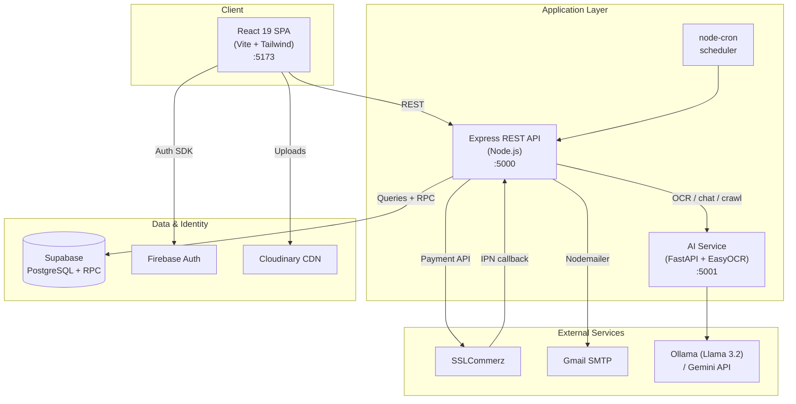
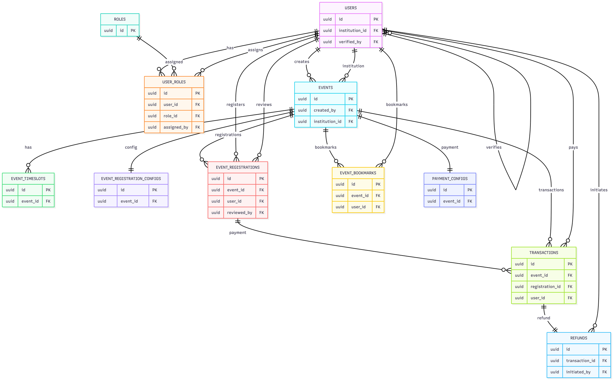
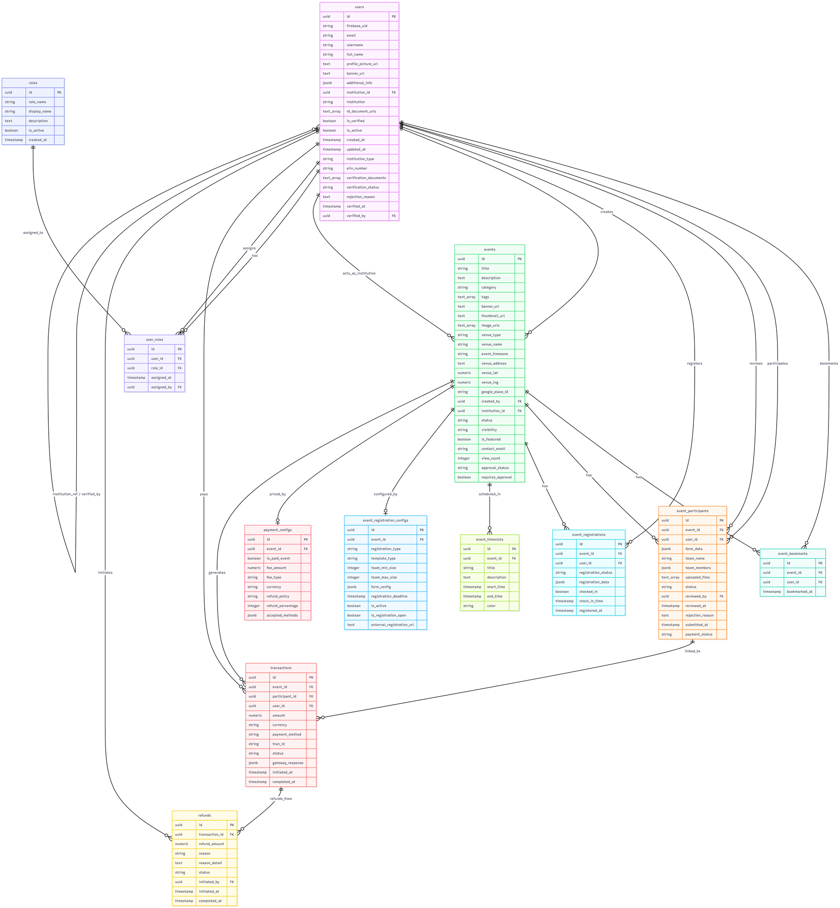
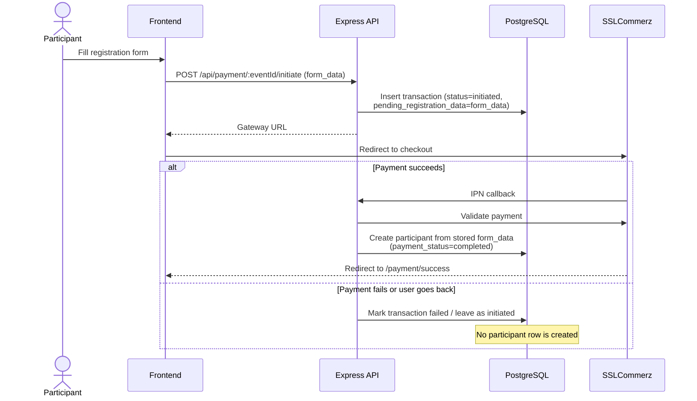

<div align="center">


# Event Corner

**A role-based event management platform for educational institutions: event creation, custom registration forms, online payments with automated refunds, and AI-assisted event drafting.**


*Course project, RDBMS Lab (6th semester), Islamic University of Technology (IUT)*

</div>

---

## Table of Contents

- [About](#about)
- [Highlights](#highlights)
- [Features by Role](#features-by-role)
- [Tech Stack](#tech-stack)
- [System Architecture](#system-architecture)
- [Database Design](#database-design)
- [Key Workflows](#key-workflows)
- [AI Features](#ai-features)
- [Project Structure](#project-structure)
- [Getting Started](#getting-started)
- [API Overview](#api-overview)
- [Testing & Quality Assurance](#testing--quality-assurance)
- [Documentation](#documentation)
- [Team](#team)

---

## About

Universities run seminars, workshops, hackathons and cultural festivals all year, but event management is usually spread across separate tools. Announcements are posted in social media groups, registrations go through Google Forms, payments are reconciled by hand, and organizers have no single view of their participants or revenue.

**Event Corner** puts the whole event lifecycle in one platform:

- Institutions and organizers **create and publish** events, with admin oversight
- Participants **discover, bookmark and register** for events through forms each organizer designs
- Paid events are processed through **SSLCommerz** (bKash, Nagad, Visa, Mastercard), with **refund policies applied automatically**
- **Email notifications** go out at every stage: approvals, rejections, cancellations and refunds

The project was built for our **RDBMS Lab** course, so the database layer is a central part of the design. Most business logic runs in **PostgreSQL stored functions** (54 of them), which keeps multi-step operations atomic and the API layer thin.

---

## Highlights

| | |
|---|---|
| 🗄️ **Database-centric design** | 14 normalized tables, 54 PL/pgSQL functions called over Supabase RPC, timestamp triggers, and 8 incremental migration scripts |
| 👥 **Five-role access control** | Super Admin, Admin, Institution, Organizer and Participant, each with its own dashboard |
| 💳 **Deferred-registration payments** | For a paid event, the participant record is created only after the payment gateway confirms payment, so abandoned payments leave no orphaned registrations |
| 🔁 **Automated refunds** | Refunds follow the event's policy (full, partial, none or custom) on self-cancellation; rejecting a paid participant or cancelling an event refunds in full |
| 🧩 **Custom form builder** | Organizers build individual or team registration forms with text, dropdown, checkbox and file-upload fields |
| 🤖 **AI assistance** | Banner OCR to event draft, conversational event creation, a role-aware help chatbot, and a contest crawler that runs on a schedule |
| 🛡️ **Security pass** | 46 bugs logged and fixed during QA, 11 of them critical (CORS, SQL injection, path traversal, race conditions, JWT verification) |

---

## Features by Role

<details open>
<summary><b>👤 Participant</b></summary>

- Browse and search published events, filtering by category, date and status
- Event detail pages with markdown descriptions, a venue map (Leaflet), schedule and fee
- Register through each event's custom form, free or paid (SSLCommerz checkout)
- Track registration status: pending, approved, rejected or cancelled
- Cancel your own registration, with a refund calculated from the event's policy
- Bookmark events and view them in a day/week calendar (FullCalendar)
- Transaction history and profile management

</details>

<details>
<summary><b>🎤 Organizer</b></summary>

- Create events with a multi-section form: basic info, map-based venue picker, multiple timeslots, banner, contact details, visibility
- Choose internal registration (built-in form builder) or an external registration URL
- Configure payments: fee, currency and refund policy
- Review applicants in Participant Management: approve or reject with a reason (rejecting a paid applicant triggers an automatic refund)
- Email all approved participants at once and export participant lists
- Cancel an event, with a preview of the impact, bulk refunds and notification emails
- Payment dashboard showing revenue and refunds per event

</details>

<details>
<summary><b>🏛️ Institution</b></summary>

- Register with an EIIN number and verification documents, then wait for admin approval
- Verify and manage the organizers affiliated with the institution
- Create and manage the institution's own events
- Institution-wide payment dashboard
- Public profile with a verification badge

</details>

<details>
<summary><b>🛠️ Admin / Super Admin</b></summary>

- Review institution registrations (approve or reject with a reason, singly or in bulk)
- User management: search, activate or deactivate accounts
- Role assignment: grant or revoke any role, including bulk assignment *(Super Admin)*
- Manage crawler sources and review AI-drafted events
- Chatbot analytics, including blocked or out-of-scope queries

</details>

---

## Tech Stack

| Layer | Technologies |
|---|---|
| **Frontend** | React 19, Vite 7, React Router 7, Tailwind CSS + DaisyUI, Axios, Leaflet / React-Leaflet + GeoSearch, FullCalendar, React MD Editor, React Markdown, Lottie, React Hot Toast |
| **Backend** | Node.js, Express 4, Supabase JS client, Helmet, CORS, express-rate-limit, Multer, Nodemailer, node-cron, JSON Web Token |
| **Database** | PostgreSQL (hosted on Supabase): stored functions, triggers, JSONB, array columns |
| **Auth** | Firebase Authentication (email/password) |
| **Payments** | SSLCommerz (`sslcommerz-lts`): initiate, IPN validation, refund API |
| **Media** | Cloudinary (banners, profile pictures), local storage for uploaded documents |
| **AI service** | Python, FastAPI, EasyOCR, PyTorch, Ollama (Llama 3.2), Google Gemini API, BeautifulSoup |
| **Email** | Gmail SMTP through Nodemailer |

---

## System Architecture



Two scheduled jobs run inside the backend:
- **Hourly**: marks events whose last timeslot has ended as expired
- **Daily (00:00)**: bulk-crawls the configured contest sources and saves the results as event drafts

---

## Database Design

The schema is the core of the project. It has **14 tables**:

| Domain | Tables |
|---|---|
| Identity & access | `users`, `roles`, `user_roles` |
| Events | `events`, `event_timeslots`, `event_approval_history`, `crawler_sources` |
| Registration | `event_registration_configs`, `event_participants`, `event_registrations` |
| Payments | `payment_configs`, `transactions`, `refunds` |
| Engagement | `event_bookmarks` |

### Entity Relationship Diagram

<p align="center">
  
</p>

<details>
<summary><b>Full ER diagram with all attributes</b></summary>
<p align="center">
  
</p>
</details>

### Stored Functions

Business logic lives in PostgreSQL functions that the API calls over Supabase RPC. They are organized by domain in [`backend/sql/`](backend/sql/):

| File | Functions | Examples |
|---|:-:|---|
| [`01_user_authentication.sql`](backend/sql/01_user_authentication.sql) | 7 | `register_user`, `login_user`, `update_user_profile`, `search_users` |
| [`02_role_management.sql`](backend/sql/02_role_management.sql) | 5 | `assign_user_role`, `remove_user_role`, `bulk_assign_role` |
| [`03_institution_management.sql`](backend/sql/03_institution_management.sql) | 10 | `verify_institution`, `bulk_verify_institutions`, `get_institution_stats` |
| [`04_event_management.sql`](backend/sql/04_event_management.sql) | 9 | `create_event_with_timeslots`, `get_events`, `get_event_by_id` |
| [`05_registration_participants.sql`](backend/sql/05_registration_participants.sql) | 13 | `submit_event_registration`, `approve_participant`, `reject_participant` |
| [`06_payment_bookmarks.sql`](backend/sql/06_payment_bookmarks.sql) | 9 | `upsert_payment_config`, `get_event_transactions`, `toggle_event_bookmark` |
| [`07_triggers.sql`](backend/sql/07_triggers.sql) | 1 | `update_events_timestamp()` trigger function |

A description of every function is in [`backend/sql/FUNCTIONS_REFERENCE.md`](backend/sql/FUNCTIONS_REFERENCE.md).

**Design notes**

- **Atomic multi-table writes**: `create_event_with_timeslots` inserts an event and all of its timeslots in a single transaction, and `register_user` creates a user and their role assignment together.
- **Flexible data in JSONB**: custom registration form definitions (`form_config`), submitted answers (`form_data`), team members and gateway responses are stored as JSONB, so organizers can define any form without schema changes.
- **Schema versioning**: [`backend/migrations/`](backend/migrations/) contains 8 incremental migrations that record how the schema grew (registration system, approvals, bookmarks, payments, re-registration after rejection, and others).
- **Indexes** on frequently filtered columns (`firebase_uid`, `email`, `event_id`, `user_id`, `status`) and **server-side pagination** on every list function.

---

## Key Workflows

### Paid Registration (Deferred Registration Model)



Both the IPN callback and the success redirect can create the participant, so a registration is still recorded if one of the two never arrives.

### Refund Rules

| Trigger | Refund |
|---|---|
| Participant cancels | According to the event policy: **full**, **partial %**, **none**, or **custom** (creates a refund request for the organizer) |
| Organizer rejects a paid applicant | **Full** refund, automatic |
| Organizer cancels the event | **Full** refund to every paid participant, whatever the policy says |

### Event Contact Verification

If an event's contact email differs from its creator's account email, the event is held as `pending_approval`. The contact receives an email with approve and reject links backed by a UUID token that expires after 7 days, which stops people from listing events under someone else's name.

More detailed flowcharts are in [`PROJECT_REPORT.md`](PROJECT_REPORT.md#detailed-level-design-flowcharts).

---

## AI Features

A separate **Python FastAPI service** ([`backend/ai/`](backend/ai/)) provides the AI-assisted features:

| Feature | How it works |
|---|---|
| **Banner → Event draft** | The organizer uploads an event poster. EasyOCR extracts the text and Llama 3.2 (through Ollama) turns it into structured event fields that pre-fill the creation form. |
| **Conversational event creation** | The organizer describes the event in a chat and the assistant fills in the event form from the conversation. |
| **Help chatbot** | A role-aware assistant on dashboards that keeps conversation context, detects intent and blocks out-of-scope questions. Usage analytics are visible to admins. |
| **Contest crawler** | Pulls upcoming contests from sources such as the Codeforces API and Toph, or parses arbitrary pages with an LLM (local Llama or the Google Gemini API). Results are saved as drafts for review, and the crawl repeats daily. |

The core platform works without the AI service. Only the features above depend on it. See [`backend/ai/SETUP.md`](backend/ai/SETUP.md) for setup.

---

## Project Structure

```
Event_Corner/
├── frontend/                     # React 19 SPA (Vite)
│   └── src/
│       ├── components/           # Navbar, ChatBot, uploaders, modals, layouts
│       ├── pages/
│       │   ├── EventAdd/         # Multi-section event creation (+ AI banner analyzer)
│       │   ├── EventEdit/
│       │   ├── events/           # Event detail, registration form, payment result pages
│       │   └── dashboard/        # superadmin/ admin/ institution/ organizer/ participant/
│       ├── providers/            # Auth context (Firebase)
│       ├── routes/               # Public & private route guards
│       └── config/api.js         # API endpoint map
│
├── backend/                      # Express REST API
│   ├── server.js                 # App entry: auth, users, institutions, events
│   ├── routes/                   # registration, payment, cancel-event, bookmark, approval, ai, crawler
│   ├── services/                 # email, sslcommerz, gemini, crawler, event
│   ├── middleware/security.js
│   ├── cron/scheduler.js         # Hourly expiry check, daily crawl
│   ├── database.sql              # Full table schema (Supabase export)
│   ├── sql/                      # Stored functions & triggers, by domain
│   ├── migrations/               # Incremental schema migrations
│   └── ai/                       # Python FastAPI service (OCR, chatbot, crawler)
│
├── er1.png, er2.png              # ER diagrams
├── PROJECT_REPORT.md             # Full project report (requirements, design, testing)
├── Bug_Report_Event_Corner.csv   # QA bug log
└── dev.js / start.js             # Run frontend + backend together
```

---

## Getting Started

### Prerequisites

- **Node.js 18+** and npm
- A **Supabase** project (PostgreSQL)
- A **Firebase** project with Email/Password authentication enabled
- A **Cloudinary** account with an unsigned upload preset
- **SSLCommerz** sandbox credentials (for paid events)
- A **Gmail** account with an App Password (for email notifications)
- *Optional, for AI features:* Python 3.10/3.11, [Ollama](https://ollama.com) with `llama3.2`, and a Google Gemini API key

### 1. Clone and install

```bash
git clone https://github.com/subarnoneel/Event_Corner.git
cd Event_Corner

npm install                       # root (dev runner)
cd backend && npm install && cd ..
cd frontend && npm install && cd ..
```

### 2. Set up the database

In the Supabase SQL editor, run the following in order:

1. [`backend/database.sql`](backend/database.sql): creates all tables. The file is a Supabase schema export with tables in alphabetical order, so if you get foreign key errors, create `users` and `roles` first.
2. [`backend/sql/01_*.sql` → `07_*.sql`](backend/sql/): stored functions and triggers.
3. Insert the five roles into `roles` (`super_admin`, `admin`, `institution`, `organizer`, `participant`).

### 3. Configure environment variables

**`backend/.env`** (see [`backend/.env.example`](backend/.env.example))

| Variable | Description |
|---|---|
| `SUPABASE_URL`, `SUPABASE_ANON_KEY` | Supabase project credentials |
| `PORT` | API port. Use `5000`, which is the frontend's default; `5001` is used by the AI service |
| `BASE_URL` | Public URL of the API (used in email approval links) |
| `FRONTEND_URL` | URL of the frontend (payment redirects, email links) |
| `GMAIL_USER`, `GMAIL_APP_PASSWORD` | SMTP credentials for notifications |
| `SSLCOMMERZ_STORE_ID`, `SSLCOMMERZ_STORE_PASSWORD`, `SSLCOMMERZ_IS_LIVE` | Payment gateway credentials (`false` for sandbox) |
| `NGROK_URL` | *Optional.* Public tunnel URL so SSLCommerz can reach the IPN endpoint during local development |
| `FIREBASE_SECRET` | Used by the security middleware for token verification |
| `GOOGLE_API_KEY` | *Optional.* Gemini API key for crawler extraction |
| `EXTRACTION_METHOD` | *Optional.* `LOCAL` (Ollama, default) or `GOOGLE_API` (Gemini) |

**`frontend/.env`** (see [`frontend/.env.example`](frontend/.env.example))

| Variable | Description |
|---|---|
| `VITE_API_BASE_URL`, `VITE_API_URL` | Backend URL, e.g. `http://localhost:5000` |
| `VITE_FIREBASE_*` | Firebase web app config |
| `VITE_CLOUDINARY_CLOUD_NAME`, `VITE_CLOUDINARY_UPLOAD_PRESET` | Cloudinary upload settings |

### 4. Run

```bash
npm run dev          # starts the backend (nodemon, :5000) and the frontend (Vite, :5173)
```

Open **http://localhost:5173**.

To enable the AI features, also run:

```bash
ollama serve                                  # terminal 2
cd backend/ai && pip install -r requirements.txt && python ai_server.py   # terminal 3
```

---

## API Overview

The REST API exposes **75+ endpoints**, grouped by domain:

| Base path | Responsibility |
|---|---|
| `/api/auth` | Register, login (Firebase UID → user + roles) |
| `/api/users` | Profile read/update |
| `/api/events` | Event CRUD, listing with filters & pagination, cancellation (with preview) |
| `/api/registration` | Form config, submit registration, status, organizer review (approve/reject), participant cancel, bulk email, export |
| `/api/payment` | Payment config, initiate, IPN/success/fail/cancel callbacks, refunds, fee waivers, transaction history |
| `/api/bookmarks` | Toggle, status, list |
| `/api/approval` | Token-based event contact verification |
| `/api/institution` | Organizer verification for an institution |
| `/api/admin`, `/api/superadmin` | Institution approval, user management, role assignment, stats |
| `/api/ai` | Banner analysis, chatbot, conversational event creation, analytics |
| `/api/crawler` | Crawl sources, crawl-and-draft, bulk crawl, drafts |

---

## Testing & Quality Assurance

- **19 functional test cases** covering authentication, event creation and verification, free and paid registration (including abandoned payments), cancellations, refunds, organizer review and bookmarks. All 19 passed. Details are in [`PROJECT_REPORT.md`](PROJECT_REPORT.md#e-project-evaluation-report).
- **46 bugs** were logged, assigned and fixed during a team review cycle, recorded in [`Bug_Report_Event_Corner.csv`](Bug_Report_Event_Corner.csv):

| Severity | Count | Examples |
|---|:-:|---|
| Critical | 11 | Open CORS policy, SQL injection risk, path traversal in document serving, unauthenticated uploads, race conditions in cancellation, unverified JWT decoding |
| High | 15 | Unhandled promise rejections, missing `useEffect` cleanups |
| Medium | 14 | — |
| Low | 6 | — |

---

## Documentation

| Document | Contents |
|---|---|
| [`PROJECT_REPORT.md`](PROJECT_REPORT.md) | Full project report: requirements (FR/NFR), architecture, flowcharts, ERD, libraries, test cases and results, sustainability analysis |
| [`backend/sql/FUNCTIONS_REFERENCE.md`](backend/sql/FUNCTIONS_REFERENCE.md) | Reference for every stored function and trigger |
| [`backend/ai/SETUP.md`](backend/ai/SETUP.md) | AI service setup and troubleshooting |
| [`frontend/src/pages/EventAdd/README.md`](frontend/src/pages/EventAdd/README.md) | Event creation module structure |
| [`Bug_Report_Event_Corner.csv`](Bug_Report_Event_Corner.csv) | QA bug log |

---

## Team

Built as a team project for the RDBMS Lab course at the **Islamic University of Technology (IUT)**, December 2025 to March 2026.

| Member | GitHub |
|---|---|
| Subarno Neel | [@subarnoneel](https://github.com/subarnoneel) |
| Nakib Saleh | [@Nakib-Saleh](https://github.com/Nakib-Saleh) |
| Multazam Mahmud | [@MultazamMahmud12](https://github.com/MultazamMahmud12) |
| M. Mahin | [@darkrai06](https://github.com/darkrai06) |
| B. Mahin | — |
| Fattah | — |

---

<div align="center">

<sub>This repository is preserved as it was submitted for the course. It is an academic project and has not been deployed to production.</sub>

</div>
